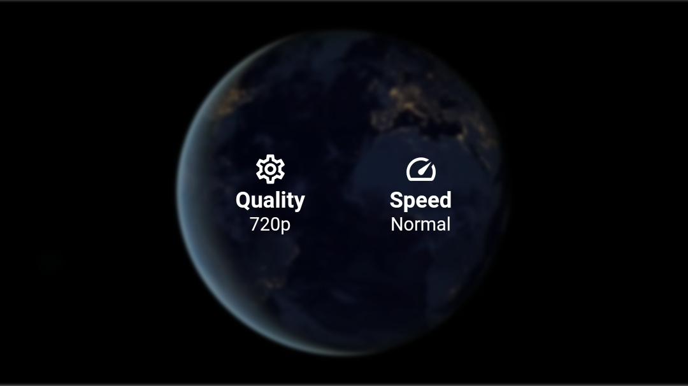

# video_viewer

## My other APIs

- [Scroll Navigation](https://pub.dev/packages/scroll_navigation)
- [Helpers](https://pub.dev/packages/helpers)

 

## Features

- Amazing UI / UX
- Fully customizable
- Fancy animations
- Cached Videos Support (beta)
- Easy and powerful implementation! :)

 

---

 

## Controls

|             Playing              |             Paused              |
| :------------------------------: | :-----------------------------: |
|  |  |

  

## Rewind and Forward

|        Double Tap Rewind        |        Double Tap Forward        |
| :-----------------------------: | :------------------------------: |
|  |  |

  

## Fullscreen

|                   Portrait                   |                   Landscape                   |
| :------------------------------------------: | :-------------------------------------------: |
|  |  |

  

## Extras

|             Settings Menu              |  Volume Bar (Only Android Support)  |
| :------------------------------------: | :---------------------------------: |
|  |  |

 

---

 

## Global Gestures

- **One Tap:** Show or hide the overlay that contains the PlayAndPauseWidget and the ProgressBar
- **Double tap:**
  - Left: Double tapping on the left side of the VideoViewer will do the **rewind**. Default 10 seconds.
  - Right: Double-tapping on the right side of the VideoViewer will **forward**. Default 10 seconds.
- **Horizontal Drag:**
  - Left: Making a horizontal movement to the left will make a **rewind** proportional to the distance traveled.
  - Right: Making a horizontal movement to the right will make a **forward** proportional to the distance traveled.
- **Vertical Drag:** Scrolling vertically will activate the VolumeBar and change the **volume** of the device. **Only available on Android**
