# video_viewer

<br>

## My other APIs

- [Scroll Navigation](https://pub.dev/packages/scroll_navigation)
- [Helpers](https://pub.dev/packages/helpers)

<br>

## Features

- Amazing UI / UX.
- Fully customizable.
- Fancy animations.
- Multiplataform support.
- Easy and powerful implementation! :)

<br><br>

## **Installation**

First, add `video_viewer` as a dependency in your **pubspec.yaml.**

```yaml
dependencies:
  video_viewer: ^1.0.1
```

### Android

Add _android.permission.INTERNET_ and _usesCleartextTraffic_ in your **Android Manifest** file, located in `<project_root>/android/app/src/main/AndroidManifest.xml`

```xml
<manifest>
    <uses-permission android:name="android.permission.INTERNET"/>
    <application android:usesCleartextTraffic="true"></aplication>
</manifest>
```

### iOS

Add the following entry to your **Info.plist** file, located in `<project_root>/ios/Runner/Info.plist`

```xml
<key>NSAppTransportSecurity</key>
<dict>
  <key>NSAllowsArbitraryLoads</key>
  <true/>
</dict>
```

**Warning:** The video player is not functional on **iOS simulators.** An iOS device must be used during development/testing.

<br><br>

## **Global Gestures**

- **One Tap:** Show or hide the overlay that contains the PlayAndPauseWidget and the ProgressBar
- **Double tap:**
  - Left: Double tapping on the left side of the VideoViewer will do the **rewind**. Default 10 seconds.
  - Right: Double-tapping on the right side of the VideoViewer will **forward**. Default 10 seconds.
- **Horizontal Drag:**
  - Left: Making a horizontal movement to the left will make a **rewind** proportional to the distance traveled.
  - Right: Making a horizontal movement to the right will make a **forward** proportional to the distance traveled.
- **Vertical Drag:**
  - Up: **Increase** video **volume** proportional to the distance traveled.
  - Down: **Decrease** video **volume** proportional to the distance traveled.

<br><br>

## **Android and iOS**

|                Playing                 |                Paused                 |
| :------------------------------------: | :-----------------------------------: |
| 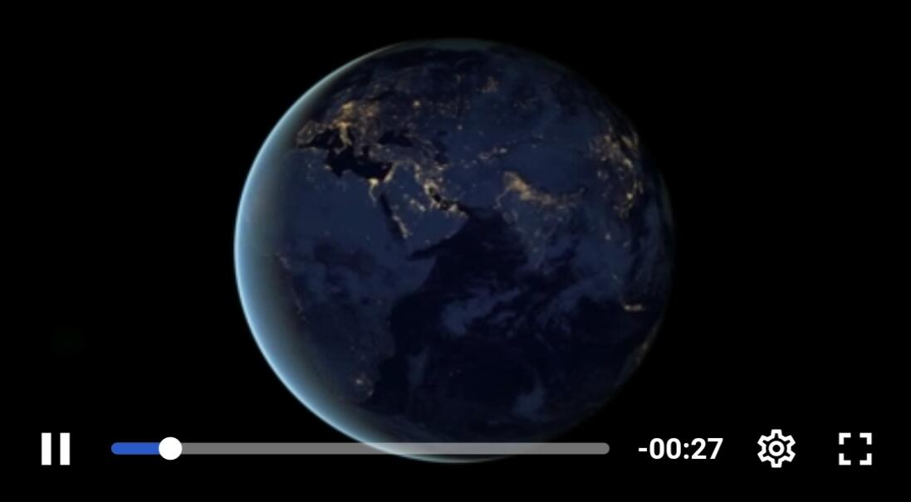 |  |

<br><br>

#### Rewind and Forward

|           Double Tap Rewind           |           Double Tap Forward           |
| :-----------------------------------: | :------------------------------------: |
|  | 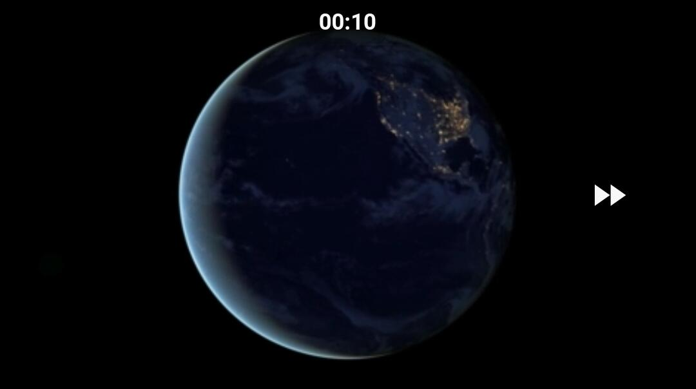 |

<br><br>

### Fullscreen

|                      Portrait                      |                      Landscape                      |
| :------------------------------------------------: | :-------------------------------------------------: |
| 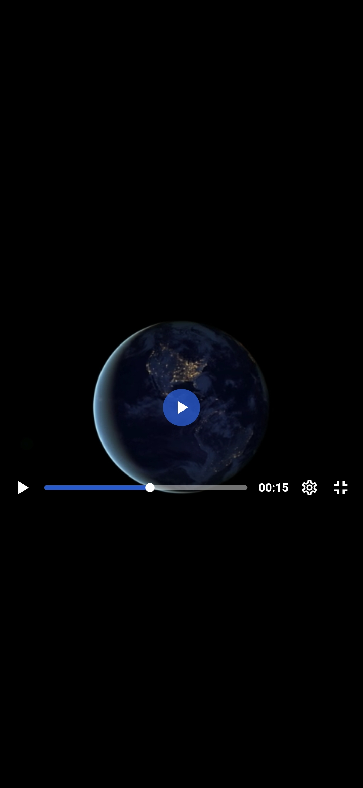 |  |

<br><br>

### Settings Menu

|                Principal Menu                |                Quality Menu                 |
| :------------------------------------------: | :-----------------------------------------: |
|  | 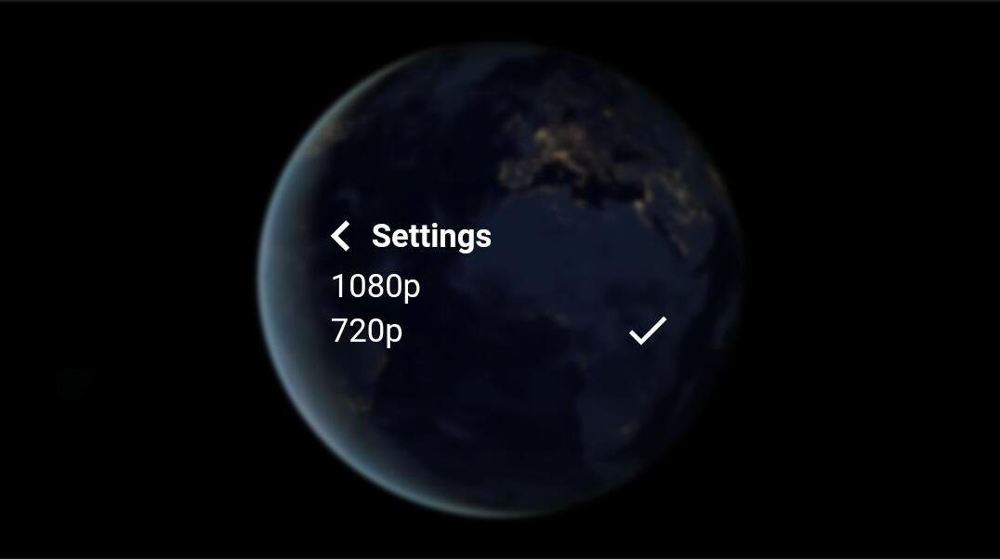 |

<br><br>

### Volume Bar


<br><br>
<br><br>

### **Web**

|               Playing                |               Paused                |
| :----------------------------------: | :---------------------------------: |
| 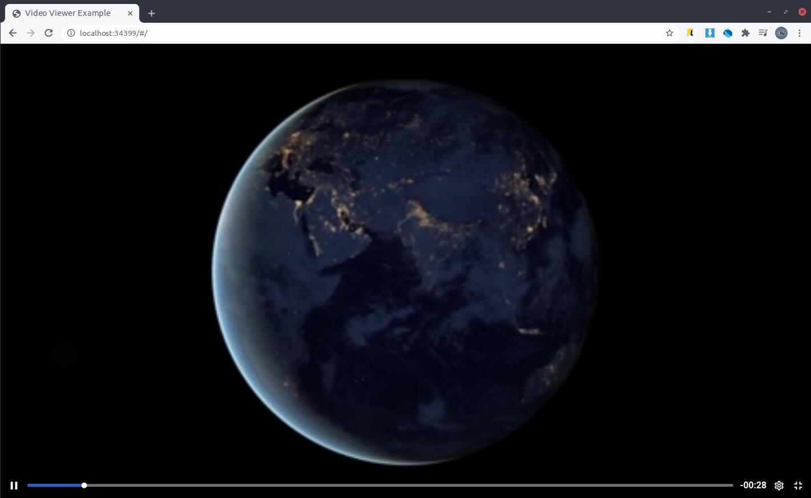 |  |

<br><br>

### Rewind and Forward

| Double Tap and Keyboard.arrowLeft Rewind | Double Tap and Keyboard.arrowRight Forward |
| :--------------------------------------: | :----------------------------------------: |
|   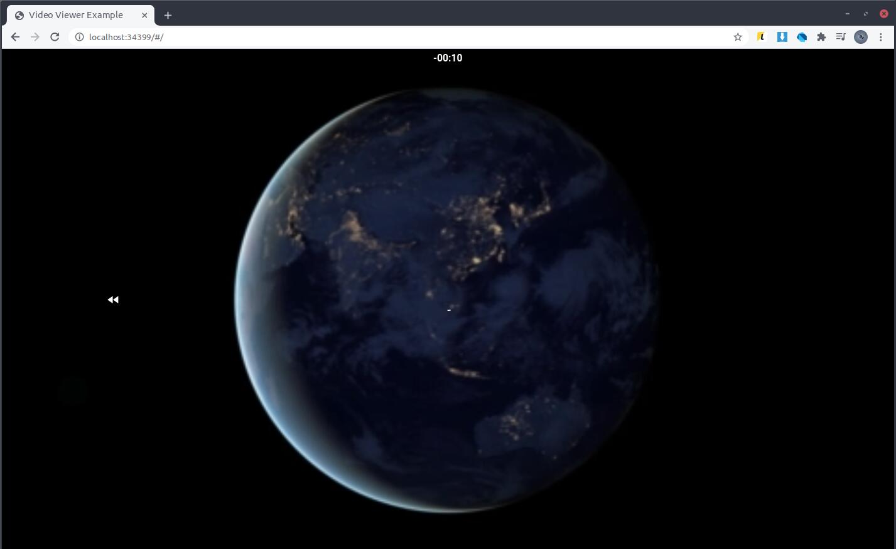    |    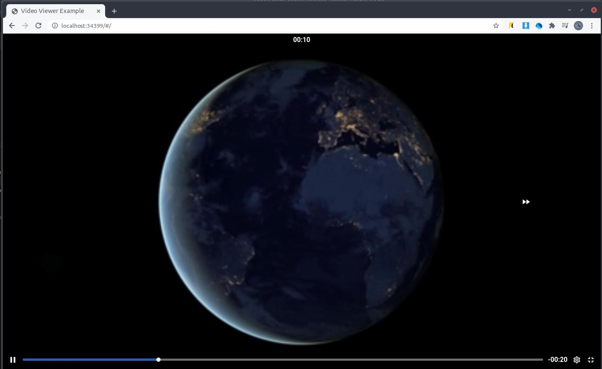    |

<br><br>

### Settings Menu

|               Principal Menu               |               Speed Menu                |
| :----------------------------------------: | :-------------------------------------: |
| 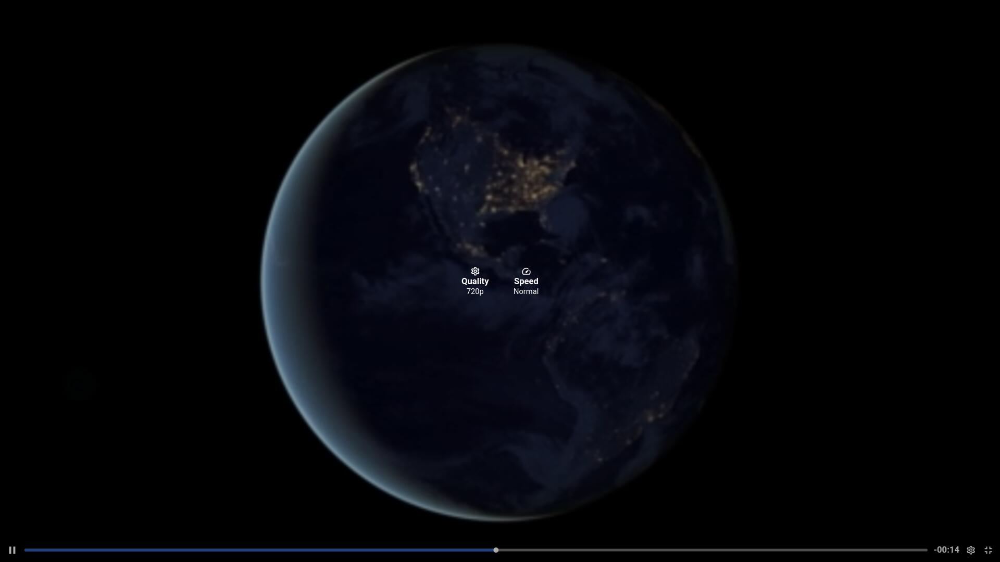 | 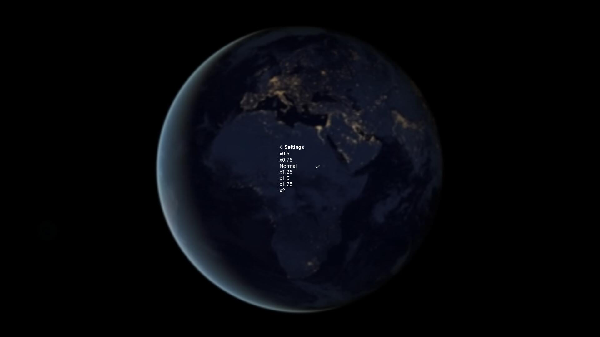 |

<br><br>

### FullScreen

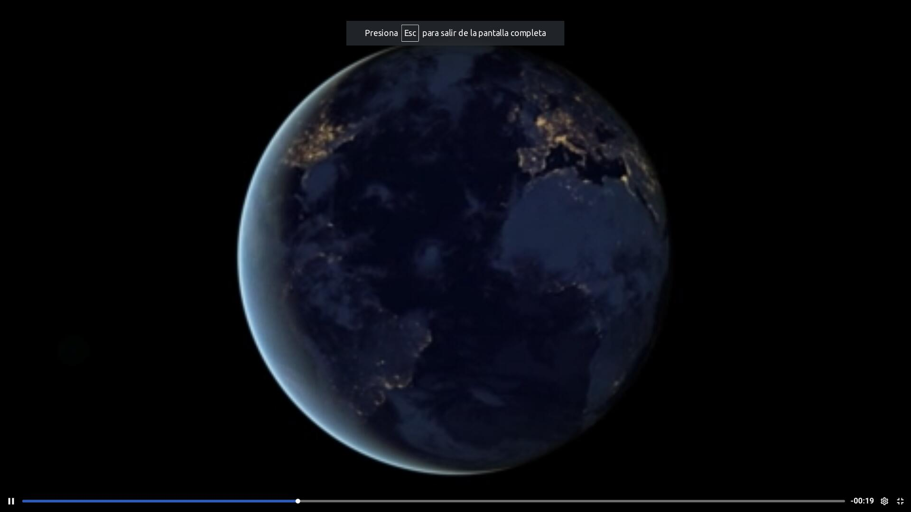

<br><br>

### Volume Bar

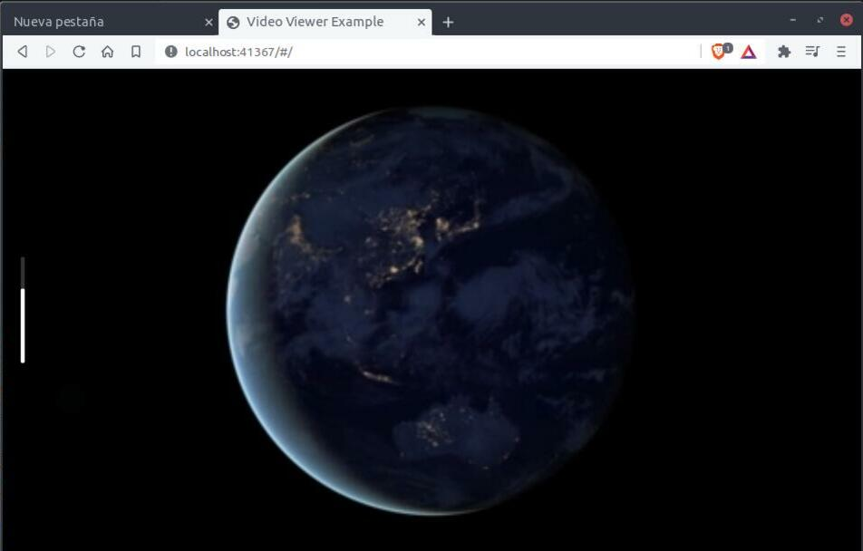
